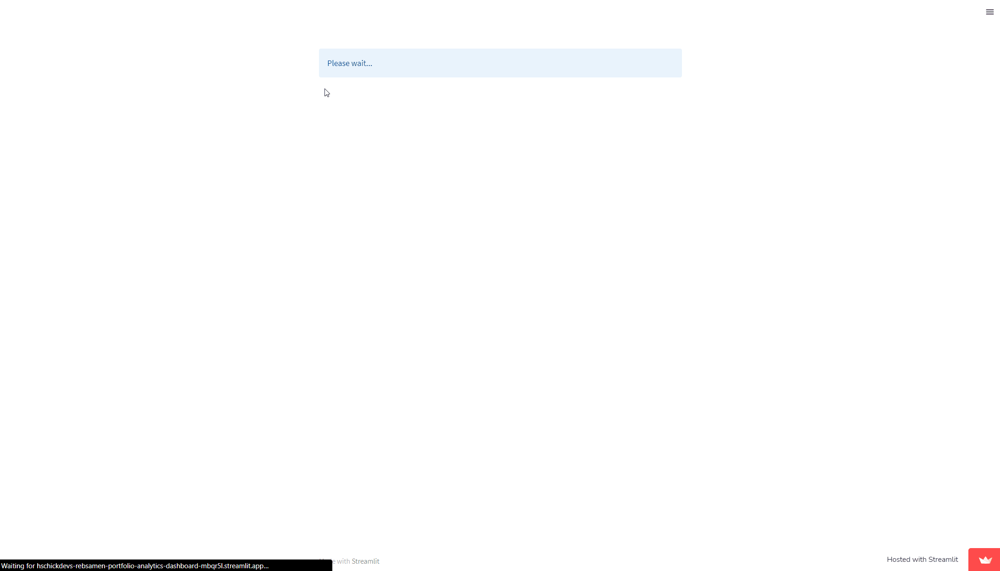

# Rebsamen Portfolio Analytics

## Current Site Link: 

> Note: The site is currently in the proof-of-concept phase.

**https://hschickdevs-rebsamen-portfolio-analytics-dashboard-mbqr5l.streamlitapp.com/**

## Project Objective

The objective of this project is to create a web dashboard that will allow students and faculty to analyze portfolio performance, holdings breakdown, algorithmic trade recommendations, and fundamental & technical stock metrics for the University of Arkansas Rebsamen Trust, managed by the undergraduate invite-only Portfolio Management I and II class at the Sam M. Walton College of Business.

## Technologies:

    
    
    
    

This project was built entirely using Python.
* The frontend was constructed using the Streamlit Python framework.
* The backend has been specifically designed using Python Pandas to process the holdings excel file format as generated directly from the Stephens trading account. 
* Live market data is pulled using the Finnhub API.

## Webapp Demo:

